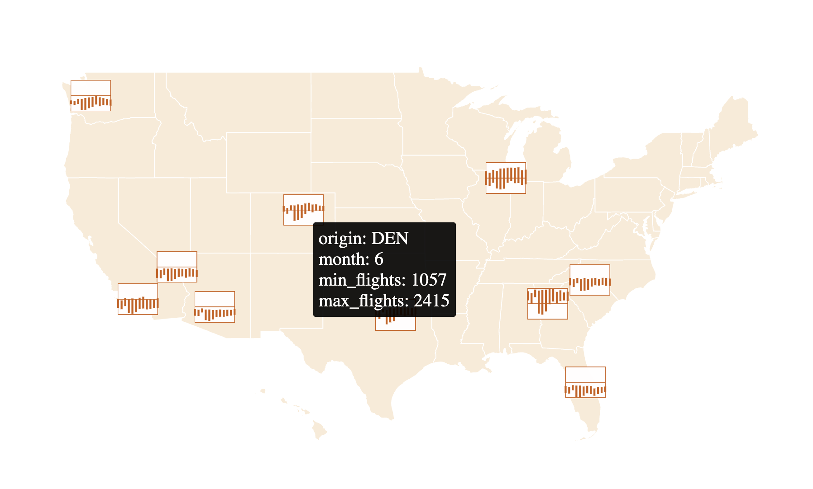

```{r setup, include=FALSE}
knitr::opts_chunk$set(echo = FALSE,
                      warning = FALSE, 
                      message = FALSE)


library(sugarglider)
library(knitr)
library(ggplot2)
library(sf)
library(tidyverse)
library(grid)
library(viridis)
library(gridExtra)
library(ozmaps)
library(ggthemes)
library(kableExtra)
library(usmap)
library(ggiraph)
library(leaflet)
library(tinytex)
```

# Introduction

```
Note: use similar terminology as cubble & glyph-maps. Add a quick start (quick guide on how to use the sugarglider package)
```

# Literature Review

## Glyph-maps

Glyph maps are specialized forms of multivariate glyph plots that represent each spatial location with a glyph, summarizing data collected over time at that location. As detailed in the paper by @wickham2012glyph, glyph maps are a refined type of multivariate glyph plots in which each spatial location is depicted by a single glyph that encapsulates data collected over time at that point. These maps are instrumental in uncovering both local and global patterns, particularly emphasizing temporal relationships.

The construction of a glyph map evolves around a transformation technique that utilizes principles of linear algebra to convert temporal coordinates (minor coordinates) into spatial coordinates (major coordinates). This transformation is implemented in packages such as `GGally` by @GGally and `cubble` by @JSSv110i07, facilitating a more integrated approach to spatio-temporal data visualization.

In order for a plot to be useful for a specific data analysis task, it should make primary comparisons easy to see. Mapping values to position is one of the easiest properties to perceive (@f076b642-1914-3749-af10-4b3bcbdaef52). Glyph-maps facilitate the display of changes in slope, trend, average value, and variance over time. They organize the graphical elements necessary for temporal comparisons. However, glyph-maps, especially when representing linear trends as icons, may be subject to the Zöllner Illusion, which distorts straight lines. Therefore, accurate perception of change requires the implementation of reference frames and scaling (@wickham2012glyph)

## Extending ggplot2 with ggproto

The architecture of ggplot2 is based on the ggproto system of object-oriented programming. nitially, ggplot2 relied on the proto system for object-oriented tasks, an S3 subclass of the R environment class. Proto objects are manipulated using the proto function, which sets the parent environment, evaluates expressions, and manages lazy evaluation of arguments (@proto).

As the demand for an official extension mechanism in ggplot2 increased, the limitations of the proto system became evident, prompting the adoption of ggproto. This transition is documented in @Wickham2016ggplot2, which also introduces how to utilize ggproto objects to extend ggplot2 functionalities.

The creation of a new ggproto object is facilitated by the ggproto() function, which requires the name of the new class and an existing ggproto object from which it will inherit. For instance, to introduce a new statistical transformation, one might create a ggproto that inherits from `Stat` and `Geom.` However, merely creating a ggproto object does not make it accessible or useful to the end user.

To bridge this gap, the creation of a layer function is necessary. An example is the `new_stat()` function, which follows a consistent format: setting defaults in the function arguments, and calling `layer()`, which handles the distribution of these arguments into either geom parameters, stat parameters, or aesthetics.

While developing ggplot2 extensions, it may seem intuitive to encapsulate extensions as new geoms, as they are frequently used by users to add layers to a plot. However, the diversity in ggplot2’s capabilities often stems more from the variety in statistical transformations (stats) than merely geometric objects (geoms), suggesting a nuanced approach in designing extensions that effectively enhance the plotting system.

# Software

The `sugarglider` package extends the capabilities of ggplot2 by introducing functions specifically designed for visualizing seasonal patterns in spatio-temporal data. It includes `geom_glyph_ribbon()` and `geom_glyph_segment()` , which represent measurements recorded over time at specific locations through the use of glyph maps. These functions enable clear depictions of seasonal trends by leveraging the combination of *x_major* and *y_major* coordinates. 

The structure of glyph maps in `sugarglider` consists of four main layers: the base map, glyph boxes, reference lines, and ribbon or segment glyphs. Additionally, users can create a legend, adding an extra layer to the glyph maps. Apart from the base map, `sugarglider` offers functionalities to generate all the elements of a comprehensive glyph map, as illustrated in the figure below.

```{r, fig.cap="The diagram depicts the structure of a glyph-map. The initial layer represents the base map, which can be generated using ggplot2::geom_sf() and ggplot2::geom_polygon(). Subsequent layers comprise of glyph boxes and reference lines, which are generated through add_glyph_boxes() and add_ref_lines() respectively. The fourth layer encompasses the glyph itself, offering users the choice to depict ribbon glyphs (geom_glyph_ribbon()) or segment glyphs (geom_segment_glyph()). The legend layer is optional. It enabling users to display a legend—a magnified version of one of the glyphs—using add_glyph_legend()."}
include_graphics("figures/glyphmap-layers.png")
```

Each layer can be plotted independently, and the package supports the creation of glyph plots using either ribbon or segment geometries. The core functionality includes:

* `geom_glyph_ribbon()`:  Displays an interval on the y-axis for each *x_minor* value, with the bounds defined by *ymin_minor* and *ymax_minor*. This function draws ribbon geometry using `geom_ribbon()` from ggplot2 to draw ribbon geometry, resulting in ribbon glyphs. Each glyph is plotted based on the combination of *x_major* and *y_major* coordinates. This functionality is particularly useful for visualizing ranges or uncertainties in the data.

* `geom_glyph_segment()`: Connects *y_minor* to *yend_minor* with a straight line using `geom_segment()` from ggplot2, resulting in segment glyphs. Each glyph is plotted based on the combination of *x_major* and *y_major* coordinates.

In addition to these two functions, `sugarglider` offers several other features that enhance the customization of glyph maps. The `add_ref_box()` function introduces reference boxes that visually frame individual glyphs, helping to define boundaries and distinguish glyphs from each other. The `add_ref_line()` function draws a horizontal midpoint for each glyph, facilitating comparisons across data points. The `add_glyph_legend()` function allows users to display an enlarged version of a randomly chosen glyph in the bottom-left corner of the panel, enabling users to visualize the data range. Lastly, the `theme_glyph()` function  provides a customized theme for glyph maps, built on top of `theme_map()` from `ggthemes`. It adjusts the plot's appearance, including the legend position, text styles, and background settings, to create a clean, visually consistent layout for glyph visualizations.

```{r, eval = FALSE, echo=TRUE}
# Ribbon glyph
vic_temp |>
   ggplot(aes(x_major = long,
              y_major = lat,
              x_minor = month,
              ymin_minor = tmin,
              ymax_minor = tmax)) +
  add_glyph_boxes() +
  add_ref_lines() +
  geom_glyph_ribbon() +
  theme_glyph()

# Segment glyph
vic_temp |>
   ggplot(aes(x_major = long,
              y_major = lat,
              x_minor = month,
              y_minor = tmin,
              yend_minor = tmax)) +
  add_glyph_boxes() +
  add_ref_lines() +
  geom_glyph_segment() +
  theme_glyph()
```

```{r comparisonPlot, fig.cap = "A comparison between ribbon and segment glyph-maps: Glyph boxes and reference lines have been added to frame each glyph and introduce a line that divides each glyph midway, helping users make inferences about the plot. Additional coding is necessary to create the base map and adjust the width and height of each glyph."}

# Data preparation -----------------------------------------------

vic_temp <- aus_temp |>
  filter(id %in% c("ASN00026021", "ASN00085291", "ASN00084143"))

nsw_temp <- aus_temp |>
  filter(id %in% c("ASN00055325", "ASN00049000"))


# Plot -----------------------------------------------

# Define a color palette
color_palette <- c("deepskyblue4", "coral3")

p1 <- vic_temp |>
   ggplot(aes(x_major = long,
              y_major = lat,
              x_minor = month,
              ymin_minor = tmin,
              ymax_minor = tmax)) +
  geom_sf(data = abs_ste |> filter(NAME == "Victoria"),
          fill = "antiquewhite", color = "white", inherit.aes = FALSE)  +
  # Customize the size of each glyph box using the width and height parameters.
  add_glyph_boxes(width = rel(2.5), height = rel(1.5),
                  color = color_palette[1]) +
  add_ref_lines(width = rel(2.5), height = rel(1.5),
                color = color_palette[1]) +
  geom_glyph_ribbon(width = rel(2.5), height = rel(1.5),
                    color = color_palette[1], fill = color_palette[1]) +
  # Theme and aesthetic
  theme_glyph() +
  labs(title = "geom_glyph_ribbon()") +
  theme(plot.title = element_text(hjust = 0.5),
        title = element_text(color = color_palette[1],
                             family  = "mono")) 

p2 <- vic_temp |>
   ggplot(aes(x_major = long,
              y_major = lat,
              x_minor = month,
              y_minor = tmin,
              yend_minor = tmax)) +
  geom_sf(data = abs_ste |> filter(NAME == "Victoria"),
         fill = "antiquewhite", color = "white", inherit.aes = FALSE)  +
  # Customize the size of each glyph box using the width and height parameters.
  add_glyph_boxes(width = rel(2.5), height = rel(1.5),
                  color = color_palette[2]) +
  add_ref_lines(width = rel(2.5), height = rel(1.5),
                color = color_palette[2]) +
  geom_glyph_segment(width = rel(2.5), height = rel(1.5),
                    color = color_palette[2]) +
  # Theme and aesthetic
  theme_glyph() +
  labs(title = "geom_glyph_segment()") +
  theme(plot.title = element_text(hjust = 0.5),
        title = element_text(color = color_palette[2]))

grid.arrange(p1, p2, ncol = 2) 
```

The `sugarglider` package provides various customization options for more flexible visualization. It includes features such as the `global_rescale` argument, which allows users to choose between global or individual glyph scaling. Users can also adjust the scaling of minor values within grid cells, as well as the overall width and height of glyphs. This ensures that the glyph-map can be finely tuned to meet specific data representation needs. The following section will explore these features in greater detail and provide practical examples that illustrate their application within different visualization contexts.

### Aesthetics

`sugarglider` provides the same aesthetics for `geom_glyph_ribbon()` and `geom_glyph_segment()` as those available in `geom_ribbon()` and `geom_segment()` from ggplot2. To include a variable in the glyph plot, it must be specified as an aesthetic. The functions in `sugarglider` expect spatial coordinates as the major axis and temporal data, along with some measurements, as the minor axis.

To produce glyph-maps, the following aesthetics are required:

|Aesthetics          | Description
|--------------- | ------------------------------------------------
|  `x_major`,`y_major`         | Spatial coordinates that define the position of glyphs.
|  `x_minor`         | Represents temporal data associated with each glyph.
|  `ymin_minor`, `ymax_minor`       | Used by `geom_glyph_ribbon()` to establish the lower and upper bounds of the ribbon geometry within each glyph.
|  `y_minor`, `yend_minor`       | Used by `geom_glyph_segment()` to set the start and end points of the segment geometry within each glyph.

The functions `add_ref_box()`, `add_ref_line()`, and `add_geom_legend()` are compatible with either *ymin_minor*, *ymax_minor*, or *y_minor*, *yend_minor*. Additionally, `sugarglider` introduces several customizable options to further tailor the visual aspects:

|Option          | Default      | Description
|--------------- | ------------ | ------------------------------------------------
| `colour`         | `"black"`         | Sets the color for line segments and borders.
|`linewidth`      | `0.5`          | Specifies the width of the line for borders.
|`linetype`         | `1`          |  Defines the style of the line for borders.
|`fill`     | `"black"`     | Determines the color of the interior area of the geometries.
|`alpha`      | `0.8`        | Controls the transparency level of the glyphs.

### Options

Options within the `sugarglider` package allow you to tailor the behavior of your visualizations to meet the specific needs of your analysis. The *global_rescale* argument provides control over whether rescaling should occur globally across all data points or be handled individually for each glyph.

`sugarglider` also offers a variety of customizable features to enhance the flexibility and precision of visualizations. For example, it facilitates the scaling of minor values within the glyph along both the x and y axes. Users can specify their own rescale function by replacing *"identity"* with a custom function in *x_scale* and *y_scale*. If a user wishes to modify the rescaling function on only one axis, they can replace the value of the corresponding parameter with their chosen function and retain "identity" for the other. In this package, "identity" rescales the minor axes to an interval of [-1,1]. The impact of rescaling on glyphs and its implications for visual interpretation will be thoroughly discussed in the upcoming section.

Additionally, the width and height of the glyphs are adjustable, allowing users to modify the appearance of each glyph to match the dimensions and scaling of the data being visualized. These customization options ensure that `sugarglider` can adapt to a broad range of data types and requirements, making it a versatile tool for seasonal spatiotemporal data visualization.

|Option          | Default      | Description
|--------------- | ------------ | ------------------------------------------------
| `x_scale`         | `"identity"`         | This function scales each set of minor values within a grid cell along the x-dimension.
|`y_scale`      | `"identity"`          | This function scales each set of minor values within a grid cell along the y-dimension.
|`width`         | `ggplot2::rel(4)`          |  Width of the glyph.
|`height`     | `ggplot2::rel(2.5)`     | Height of the glyph.
|`global_rescale`      | `TRUE`        | Determines whether rescaling is applied globally across all glyphs or individually for each glyph


### Data structure

When using the `sugarglider` package to create glyph plots, the first step is to ensure that your data is in the correct format. There are two data structures to consider as per @JSSv110i07, and one of them is compatible with `sugarglider`. The package supports data structured in a long format that includes both temporal and spatial elements.

`sugarglider` includes an dataset called `aus_temp`, which is sourced from The National Oceanic and Atmospheric Administration (NOAA). This dataset provides a comprehensive set of climate data from 29 stations across Australia for the year 2020. It includes important climate variables such as precipitation and temperature, as well as key spatial elements (longitude and latitude) and temporal elements (month), along with temperature ranges. These temperature ranges are crucial for determining the widths of the ribbon and segment plots in glyph-maps.

```{r, echo = TRUE}
glimpse(aus_temp)
```

Datasets may not always include both spatial and temporal elements. Analysts often start with station data that provides geographic locations, recorded variables, and the time periods of these variables. To extract relevant data, they can query the temporal variables for specific stations of interest. In some cases, analysts may start with purely spatial or purely temporal data, which then requires additional elements to transform it into a spatio-temporal format.

For these situations, the `cubble` package offers functions such as `make_cubble()` to help users structure their data into **cubble** objects, which are optimized for use with glyph-maps. This structuring facilitates the creation of detailed and insightful spatio-temporal visualizations, enabling the data to be seamlessly integrated into the `sugarglider` package.

### Rescale

In `sugarglider`, rescaling is a crucial preprocessing step applied to the minor axes, which are the data used to plot individual glyphs. This rescaling prepares the data for a linear transformation that maps temporal data onto a spatial representation. This important process will be explored in greater detail in the subsequent section. The rescaling mechanism is governed by two parameters: *x_scale* and *y_scale*. The *x_scale* parameter adjusts the minor values along the x-dimension within each glyph, while *y_scale* modifies them along the y-dimension.

By default, the rescaling function is set to "identity", which adjusts the minor axes to fit within the interval [-1, 1]. However, users can customize the rescaling function by replacing the default settings for *x_scale* and *y_scale* with their own functions. For example, the following code demonstrates a custom rescale function that transforms values to fit within the interval [0, 1]. When this custom rescale is applied, the resulting ribbon in the plot appears significantly thinner compared to the previous example, which used the default rescaling settings

```{r, eval=FALSE, echo=TRUE}
# Default rescale 
nsw_temp |>
   ggplot(aes(x_major = long,
              y_major = lat,
              x_minor = month,
              ymin_minor = tmin,
              ymax_minor = tmax)) +
  geom_glyph_ribbon() +
  theme_glyph() 

# Custom rescale 
custom_rescale <- function(dx) {
  rng <- range(dx, na.rm = TRUE)
  # Rescale dx to [0,1]
  rescaled <- (dx - rng[1]) / (rng[2] - rng[1])
}

nsw_temp |>
   ggplot(aes(x_major = long,
              y_major = lat,
              x_minor = month,
              ymin_minor = tmin,
              ymax_minor = tmax)) +
  geom_glyph_ribbon(x_scale = custom_rescale,
                    y_scale = custom_rescale) +
  theme_glyph() 
```

```{r defaultRescale, fig.cap="The figure illustrates the effect of rescaling on ribbon glyphs. With the default rescaling, all minor axes are adjusted to fit within the interval [-1, 1], whereas the custom rescale function adjusts the minor axes to the interval [0, 1]. Additional code is required to plot the base map alongside the rescaled glyphs."}
# Default rescale
def_rescale <- nsw_temp |>
   ggplot(aes(x_major = long,
              y_major = lat,
              x_minor = month,
              ymin_minor = tmin,
              ymax_minor = tmax)) +
  geom_sf(data = abs_ste |> filter(NAME == "New South Wales"),
         fill = "antiquewhite", color = "white",
         inherit.aes = FALSE) +
  geom_glyph_ribbon() +
  theme_glyph() + 
  labs(title = "Default Rescale") +
  coord_sf(xlim = c(140,155))


# Custom rescale function 
custom_rescale <- function(dx) {
  rng <- range(dx, na.rm = TRUE)
  # Rescale dx to [0,1]
  rescaled <- (dx - rng[1]) / (rng[2] - rng[1])
}

# Customized rescale function
cus_rescale <- nsw_temp |>
   ggplot(aes(x_major = long,
              y_major = lat,
              x_minor = month,
              ymin_minor = tmin,
              ymax_minor = tmax)) +
  geom_sf(data = abs_ste |> filter(NAME == "New South Wales"),
         fill = "antiquewhite", color = "white",
         inherit.aes = FALSE) +
  geom_glyph_ribbon(x_scale = custom_rescale,
                    y_scale = custom_rescale) +
  theme_glyph() +
  labs(title = "Custom Rescale") +
  coord_sf(xlim = c(140,155))

grid.arrange(def_rescale, cus_rescale, ncol = 2)
```

To fully grasp the impact of rescaling on the mapping of temporal data to glyphs, it's important to consider how this process applies to both `geom_glyph_ribbon()` and `geom_glyph_segment()`. The transformation of spatio-temporal data into visual representations will be explored in greater detail in the next section.

Additionally, `sugarglider` gives users the flexibility to choose whether rescaling is applied globally across all glyphs or individually for each glyph. This behavior is controlled by the `global_rescale` parameter, which defaults to *TRUE*. When `global_rescale` is set to *FALSE*, users can implement local rescaling, allowing each glyph to be scaled independently. The difference between global and local rescaling is evident in the following example: 

```{r, eval=FALSE, echo=TRUE}
# Global rescale
aus_temp |>
  ggplot(aes(
    x_major = long, 
    y_major = lat, 
    x_minor = month, 
    y_minor = tmin, 
    yend_minor = tmax)) +
  add_glyph_boxes() +
  add_ref_lines() +
  geom_glyph_segment(global_rescale = TRUE) +
  theme_glyph()

# Local Rescale
aus_temp |>
  ggplot(aes(
    x_major = long, 
    y_major = lat, 
    x_minor = month, 
    y_minor = tmin, 
    yend_minor = tmax)) +
  add_glyph_boxes() +
  add_ref_lines() +
  geom_glyph_segment(global_rescale = FALSE) +
  theme_glyph()
```

```{r, fig.cap="The figure highlights the impact of global and local rescaling on segment glyphs. With global rescaling, the temperature range is uniform across all glyphs, allowing users to compare variation in temperature between stations across Australia. In contrast, with local rescaling, the temperature range varies between glyphs, enabling more detailed insights into the temperature distribution at individual stations. Additional code is required to plot the base map and specify the xlim for the sf coordinates."}
# Global rescale
p1 <- aus_temp |>
  ggplot(aes(
    x_major = long, 
    y_major = lat, 
    x_minor = month, 
    y_minor = tmin, 
    yend_minor = tmax)) +
  geom_sf(data = abs_ste, fill = "antiquewhite",
          inherit.aes = FALSE, color = "white") +
  coord_sf(xlim = c(110,155)) +
  # Add glyph box to each glyph
  add_glyph_boxes() +
  # Add reference lines to each glyph
  add_ref_lines() +
  # Glyph segment plot with global rescale
  geom_glyph_segment(global_rescale = TRUE) +
  labs(title = "Global Rescale") +
  theme_glyph()
  
# Local Rescale
p2 <- aus_temp |>
  ggplot(aes(
    x_major = long, 
    y_major = lat, 
    x_minor = month, 
    y_minor = tmin, 
    yend_minor = tmax)) +
  geom_sf(data = abs_ste, fill = "antiquewhite",
          inherit.aes = FALSE, color = "white") +
  coord_sf(xlim = c(110,155)) +
  # Add glyph box to each glyph
  add_glyph_boxes() +
  # Add reference lines to each glyph
  add_ref_lines() +
  # Glyph segment plot with local rescale
  geom_glyph_segment(global_rescale = FALSE) +
  labs(title = "Local Rescale") +
  theme_glyph()

grid.arrange(p1, p2, ncol = 2) 

```


The rescaling process in `sugarglider` involves several steps. First, the function checks for any custom scaling based on the `x_scale` and `y_scale` parameters. It then groups the data based on the designated grouping variable to ensure that each glyph is drawn as a distinct path. If `global_rescale` is set to *TRUE*, the data is ungrouped before rescaling the minor axes, ensuring consistent scaling across all glyphs. Conversely, if `global_rescale` is set to *FALSE*, the data remains grouped, resulting in local scaling for each individual glyph.

For both `geom_glyph_ribbon()` and `geom_glyph_segment()`, rescaling is applied separately to the `ymin_minor` and `ymax_minor` values, or to the `y_minor and yend_minor values, respectively. This ensures that both the lower and upper bounds are adjusted independently to fit within the specified scale, maintaining accuracy and clarity in the visualization.

### Spatial-temporal transformation

```{r , echo=FALSE, fig.cap="Diagram highlights how spatial data (geographical location) is combined with temporal data (measurements over time) to create a spatio-temporal visualization. In sugarglider, the transformation maps each station's temporal measurements into a visual glyph, allowing users to see patterns over time across different spatial locations."}
knitr::include_graphics("figures/diagram-transformation.png")
```

The construction of a glyph map, as described in @wickham2012glyph, involves a linear combination of two key structural components: spatial location and data values. In this context, the major axes represent the spatial coordinates, latitude ($y_{major}$) and longitude ($x_{major}$), while the minor axes correspond to time ($x_{minor}$) and a measurement of interest ($ymax_{minor}$ and $ymin_{minor}$). For segment glyphs, the measurement is represented by $y_{minor}$ and $yend_{minor}$.

Once the minor axes are rescaled to the interval [-1, 1], the final coordinates for the ribbon glyph are determined through a linear transformation, as follows:

\begin{aligned}
\text{x} &= \text{x}_{\text{major}} + \frac{\text{width}}{2} \cdot \text{x}_{\text{minor}} \\
\text{ymin} &= \text{y}_{\text{major}} + \frac{\text{height}}{2} \cdot \text{ymin}_{\text{minor}} \\
\text{ymax} &= \text{y}_{\text{major}} + \frac{\text{height}}{2} \cdot \text{ymax}_{\text{minor}}

\end{aligned}

Similarly, the coordinates for the segment glyph are computed as:

\begin{aligned}
\text{x} &= \text{x}_{\text{major}} + \frac{\text{width}}{2} \cdot \text{x}_{\text{minor}} \\
\text{y} &= \text{y}_{\text{major}} + \frac{\text{height}}{2} \cdot \text{y}_{\text{minor}} \\
\text{yend} &= \text{y}_{\text{major}} + \frac{\text{height}}{2} \cdot \text{yend}_{\text{minor}}

\end{aligned}

This linear transformation ensures that the temporal and data components are properly aligned with the spatial coordinates, enabling a clear and accurate visualization of spatio-temporal data. 

### Examples

The `aus_temp` dataset is used to demonstrate the functionality of the `sugarglider` package. Using the default rescaling parameters, we can visualize temperature data with `geom_glyph_segment()`, alongside `geom_point()` that mark the location of each weather station. Each segment glyph represents local climate data, providing an intuitive way to explore temperature variations across Australia.

The default identity scaling function is applied to each set of minor values within each glyph. This method centers the glyphs both vertically and horizontally based on the station's coordinates and adjusts the minor axes to fit within the interval [-1, 1]. This ensures that the glyphs are appropriately scaled and sized to fit within the defined dimensions of the glyph.

```{r, echo=TRUE, eval=FALSE}
aus_temp |>
  ggplot(aes(
    x_major = long, 
    y_major = lat, 
    x_minor = month, 
    y_minor = tmin, 
    yend_minor = tmax)) +
  add_glyph_boxes() +
  geom_point(aes(x = long, y = lat,
                 color = "Weather Station")) +
  geom_glyph_segment() +
  theme_glyph()
```

```{r ,fig.cap="Daily temperature variations across Australian weather stations are visualized using Geom points to display the weather station locations. Additional codes are required for the base map."}
aus_temp |>
  ggplot(aes(
    x_major = long, 
    y_major = lat, 
    x_minor = month, 
    y_minor = tmin, 
    yend_minor = tmax)) +
  geom_sf(data = abs_ste, fill = "antiquewhite",
          inherit.aes = FALSE, color = "white") +
  coord_sf(xlim = c(110,155)) +
  # Add glyph box to each glyph
  add_glyph_boxes(
    width = 4,
    height = 3) +
  # Add points for weather station 
  geom_point(aes(x = long, y = lat,
                 color = "Weather Station")) +
  # Customize the size of each glyph box using the width and height parameters.
  geom_glyph_segment(
    width = 4, height = 3,
    aes(color = "Temperature")) +
  # Theme and aesthetic 
  scale_color_manual(
    values = c("Weather Station" = "firebrick",
               "Temperature" = "black")) +
  labs(color = "Data",
       title = "Daily Temperature Variations Across Australian Weather Stations")  +
  theme_glyph()
```

The previous segment glyph map used global rescaling (enabled by default), meaning the glyphs were sized relative to one another based on their data values. By disabling global rescaling, we can observe the effects of local rescaling, where each glyph is resized according to its individual values.

* Local Rescale (global_rescale = FALSE): Each line segment's length is determined by the local temperature range within a region, highlighting regional differences in temperature patterns.
* Global Rescale (global_rescale = TRUE): The global temperature range dictates the length of each line segment, ensuring consistent data scaling across all regions, which facilitates easy comparison.

Building on the analysis, precipitation data across Australia can be visualized using `geom_glyph_ribbon()`. The glyphs are color-coded to represent different levels of rainfall, while reference lines and glyph boxes are added to improve clarity and facilitate easy comparisons of precipitation levels across the country.

```{r, echo=TRUE, eval=FALSE}
aus_temp |>
   group_by(id) |>
   mutate(prcp = mean(prcp, na.rm = TRUE)) |>
   ggplot(aes(x_major = long, y_major = lat,
              x_minor = month, ymin_minor = tmin,
              ymax_minor = tmax, 
              fill = prcp, color = prcp)) +
   add_glyph_boxes() +
   add_ref_lines() +
   geom_glyph_ribbon() +
   theme_glyph()
```

```{r, fig.cap="Precipitation and Temperature Ranges Across Australia. Each glyph is color coded based on the level of precipitation, with sky blue representing the lowest and navy blue representing the highest. Additional codes are needed for the base map and additional theme customization."}
aus_temp |>
   group_by(id) |>
   mutate(prcp = mean(prcp, na.rm = TRUE)) |>
   ggplot(aes(x_major = long, y_major = lat,
              x_minor = month, ymin_minor = tmin,
              ymax_minor = tmax, 
              fill = prcp, color = prcp)) +
  geom_sf(data = abs_ste, fill = "antiquewhite",
          inherit.aes = FALSE, color = "white") +
  # Add glyph box to each glyph
   add_glyph_boxes() +
  # Add ref line to each glyph
   add_ref_lines() +
  # Add glyph ribbon plots
   geom_glyph_ribbon() +
   coord_sf(xlim = c(112,155)) +
  # Theme and aesthetic 
  theme_glyph() +
  scale_fill_gradientn(colors = c("#ADD8E6", "#2b5e82", "dodgerblue4")) +
  scale_color_gradientn(colors = c( "#ADD8E6", "#2b5e82", "dodgerblue4")) +
  labs(fill = "Percepitation", color = "Percepitation",
       title = "Precipitation and Temperature Ranges Across Australia") 
```

To compare temperature trends across different years for specific regions in Victoria, `geom_glyph_ribbon()` offers an effective way to visualize how temperatures have evolved over time. Each year is distinguished by a different color, making the trends clear and easy to interpret.

```{r, echo=TRUE, eval=FALSE}
historical_temp |> 
  filter(id %in% c("ASN00026021", "ASN00085291", "ASN00084143")) |>
   ggplot(aes(color = factor(year), fill = factor(year),
              group = interaction(year,id),
              x_major = long, y_major = lat,
              x_minor = month, ymin_minor = tmin, 
              ymax_minor = tmax)) +
   add_glyph_boxes() +
   add_ref_lines() +
   geom_glyph_ribbon() +
   theme_glyph()
```

```{r, fig.cap="Temperature Trends in Selected Victorian Weather Stations. Additional codes are required for the base map, title, and further theme customization."}

historical_temp |> 
  filter(id %in% c("ASN00026021", "ASN00085291", "ASN00084143")) |>
   ggplot(aes(color = factor(year), fill = factor(year),
              group = interaction(year,id),
              x_major = long, y_major = lat,
              x_minor = month, ymin_minor = tmin, 
              ymax_minor = tmax)) +
  geom_sf(data = abs_ste |> filter(NAME == "Victoria"),
           fill = "antiquewhite", color = "white",
          inherit.aes = FALSE)  +
  # Customized the dimension of each glyph with `width` and `height` parameters
   add_glyph_boxes(width = rel(2),
                   height = rel(1.5)) +
   add_ref_lines(width = rel(2),
                 height = rel(1.5)) +
   geom_glyph_ribbon(alpha = 0.5,
                     width = rel(2),
                     height = rel(1.5)) +
  labs(x = "Longitude", y = "Latitude",
       color = "year", fill = "year",
       title = "Temperature Trends in Selected Victorian Weather Stations") +
  # Theme and aesthetic
  theme_glyph() +
  theme(legend.position.inside = c(.4,0)) +
  scale_colour_wsj("colors6") +
  scale_fill_wsj("colors6") 

```

To further improve map readability, the `add_geom_legend()` function integrates an enlarged version of one of the glyphs in the bottom left corner of the plot. This legend helps users interpret the data scale more effectively.

In the example below, ribbon glyph-map is created using geom_glyph_ribbon() and overlaid on a basemap to depict daily temperature variations across Australian weather stations. A legend is added via `add_glyph_legend()`, allowing users to easily interpret the range of daily temperature values based on a randomly selected weather station. Since the legend data is drawn from a single, randomly chosen station, it is important to set a seed for reproducibility to ensure consistent results.

```{r, echo=TRUE, eval=FALSE}
set.seed(28493)
aus_temp |>
   ggplot(aes(x_major = long, y_major = lat,
              x_minor = month, ymin_minor = tmin,
              ymax_minor = tmax)) +
  add_glyph_boxes() +
  add_ref_lines() +
  add_glyph_legend() +
  geom_glyph_ribbon() +
  theme_glyph() 
```

```{r, fig.cap="Temperature Ranges Across Australia with Glyph Legend. Additional code is needed for the base map and additional theme customization."}
set.seed(28493)
aus_temp |>
   ggplot(aes(x_major = long, y_major = lat,
              x_minor = month, ymin_minor = tmin,
              ymax_minor = tmax)) +
  geom_sf(data = abs_ste, fill = "antiquewhite",
          inherit.aes = FALSE, color = "white") +
  add_glyph_boxes(color = "#227B94") +
  add_ref_lines(color = "#227B94") +
  add_glyph_legend(color = "#227B94", fill = "#227B94") +
  # Add a ribbon legend
  geom_glyph_ribbon(color = "#227B94", fill = "#227B94") +
  theme_glyph() +
  labs(title = "Temperature Ranges Across Australia with Glyph Legend")

```

In this example, the `flight` data is used to showcase the interactive glyph map features of `sugarglider`. The U.S. Department of Transportation (DOT) Bureau of Transportation Statistics monitors the on-time performance of domestic flights operated by major U.S. airlines. Each month, the DOT publishes the Air Travel Consumer Report, summarizing on-time, delayed, canceled, and diverted flights.

This dataset, obtained from the Kaggle Airline Flight Delay and Cancellation data, has been processed and aggregated to display the minimum and maximum number of flights originating from the top 10 U.S. airports with the highest cancellation rates.

```{r}
head(flights) |>
  kable() |> kable_styling()
```

This example demonstrates the functionality of `geom_glyph_segment()`, which shows the monthly range of flights for each airport and provides insights into how flight numbers change over time. Additionally, `geom_glyph_ribbon()` is used to visualize the variation between the minimum and maximum number of flights from each airport, offering a clear depiction of the spread in flight activity.

```{r, echo=TRUE, eval=FALSE}
# Specify tooltip for ggiraph 
flights <- flights |>
  mutate(tooltip = paste("origin: ",origin,
                         "\nmonth: ", month,
                         "\nmin_flights: ", min_flights,
                         "\nmax_flights: ", max_flights))

fl <- flights |> 
  ggplot(aes(x_major = long, y_major = lat,
             x_minor = month, y_minor = min_flights,
             yend_minor = max_flights,
             tooltip = tooltip)) + 
  add_glyph_boxes() +
  add_ref_lines() +
  geom_glyph_segment() +
  theme_glyph()

# Interactive plot using ggiraph
girafe(ggobj = fl)
```

```{r}
USmap <- us_map(regions = "state") |>
  filter(full != "Alaska")

# Specify tooltip for ggiraph 
flights <- flights |>
  mutate(tooltip = paste("origin: ",origin,
                         "\nmonth: ", month,
                         "\nmin_flights: ", min_flights,
                         "\nmax_flights: ", max_flights))

fl <- flights |> 
  ggplot(aes(x_major = long, y_major = lat,
             x_minor = month, y_minor = min_flights,
             yend_minor = max_flights,
             tooltip = tooltip)) + 
  geom_sf(data = USmap, color = "white",
          fill = "antiquewhite", inherit.aes = FALSE) +
  coord_sf(crs = st_crs(4326)) +
  add_glyph_boxes(color = "#CD5C08") +
  add_ref_lines(color = "#CD5C08") +
  geom_glyph_segment(color = "#CD5C08") +
  labs(title = "Monthly Flight Variability",
       subtitle = "Based on top 10 US Airports with high cancellations rate") +
  theme_glyph() 

# Interactive plot using ggiraph
# girafe(ggobj = fl)
```

```{r, fig.cap="Monthly Flight Variability Based on the top 10 US airports with high cancellation rates. Additional codes are needed for the base map and additional theme customization."}

```


This visualization shows the range of departing flights from each airport on a map. Each line represents the flight range for a specific airport, with the length of the line showing the variability in flight numbers across different locations. Notably, airports like ATL and ORD generally handle a higher volume of departing flights compared to airports such as MCO and PHX. All airports exhibit fluctuations throughout the year, with wider flight intervals in the middle of the year and narrower intervals during the holiday season at year-end.

The graph highlights that airports in certain regions experience more variability than others. While the line plots provide a clear estimate of this variability, the use of geom_glyph_ribbon() enhances understanding by visually representing the gap between the minimum and maximum flights. Wider ribbons indicate greater month-to-month fluctuations in flight operations.

```{r, echo=TRUE, eval=FALSE}
# South Region
flights |> 
  filter(origin %in% c("ATL", "CLT", "MCO", "DFW")) |>
  ggplot(aes(x_major = long, y_major = lat,
             x_minor = month, ymin_minor = min_flights,
             ymax_minor = max_flights)) + 
  add_glyph_boxes() +
  add_ref_lines() +
  geom_glyph_ribbon() +
  theme_glyph()

# West region
flights |> 
  filter(origin %in% c("PHX", "LAS", "LAX", "SEA")) |>
  ggplot(aes(x_major = long, y_major = lat,
             x_minor = month, ymin_minor = min_flights,
             ymax_minor = max_flights)) + 
  add_glyph_boxes() +
  add_ref_lines() +
  geom_glyph_ribbon() +
  theme_glyph()
```

```{r, fig.cap="Comparison of flight patterns between the western and southern regions. Additional codes are needed for the base map and additional theme customization."}
south <- us_map(include = .south_region)
west <- us_map(include = .west_region, exclude = c("AK", "HI"))
  
  
southR <- flights |> 
  filter(origin %in% c("ATL", "CLT", "MCO", "DFW")) |>
  ggplot(aes(x_major = long, y_major = lat,
             x_minor = month, ymin_minor = min_flights,
             ymax_minor = max_flights)) + 
  geom_sf(data = south, color = "white",
          fill = "antiquewhite", inherit.aes = FALSE) +
  coord_sf(crs = st_crs(4326)) +
  add_glyph_boxes(color = "#A6B37D") +
  add_ref_lines(color = "#A6B37D") +
  geom_glyph_ribbon(color = "#A6B37D", fill = "#A6B37D")  +
  labs(title = "South Region") +
  theme_glyph() 

westR <- flights |> 
  filter(origin %in% c("PHX", "LAS", "LAX", "SEA")) |>
  ggplot(aes(x_major = long, y_major = lat,
             x_minor = month, ymin_minor = min_flights,
             ymax_minor = max_flights)) + 
  geom_sf(data = west, color = "white",
          fill = "antiquewhite", inherit.aes = FALSE) +
  coord_sf(crs = st_crs(4326)) +
  add_glyph_boxes(color = "#CD5C08") +
  add_ref_lines(color = "#CD5C08") +
  geom_glyph_ribbon(color = "#CD5C08", fill = "#CD5C08")  +
  labs(title = "West Region") +
  theme_glyph() 

grid.arrange(westR, southR, ncol = 2)
```

`geom_glyph_ribbon()` effectively highlights the disparities in flight volume between regions. The Western region exhibits a greater variation in the number of flights compared to the Southern region, as evidenced by the thicker ribbons. Notably, both regions display a significant increase in flight volume discrepancies during the mid-year, reinforcing the findings observed with `geom_glyph_segment()`.

# Application 


### Victoria train station patronage

Interactive graphics are particularly useful when working with spatio-temporal data as they allow users to explore the data from multiple perspectives. The `cubble` package, exemplifies this by creating linked interactive plots using `crosswalk::bscols()` (@JSSv110i07). In this paper, we will demonstrate how to create interactive glyph maps using Leaflet.

The dataset used in this example, `train`, provides a comprehensive monthly summary of daily patronage at each train station in Victoria for the fiscal year 2023-2024. To create interactive glyph maps with Leaflet, we first need to save each glyph as a PNG and then add these to the Leaflet basemap as icons. The process begins by creating a list of all unique train stations that service both metro and vline. We then iterate over each station and generate ribbon glyphs using `geom_glyph_ribbon()`, `add_glyph_boxes()` and `add_ref_lines()`. Each glyph is saved in PNG format, and the file paths for all the PNGs are stored in an object for the next step.

```{r, eval=FALSE}

# Generate a list of unique train stations
df_station <- train$station_name |> unique()

# Generate PNG of all the ribbon glyph
purrr::map(1:length(df_station), function(i) {
  dt <- train |> filter(station_name == df_station[i])
  p <- dt |>
  ggplot(aes(x_major = long, y_major = lat,
                   x_minor = month_year, ymin_minor = min_monthly,
                   ymax_minor = max_monthly)) +
    add_glyph_boxes(color = "#FFAD60", 
                    fill = "#FFEEAD", alpha = 0.5,
                    linewidth = 1, width = 3, height  =2) +
    add_ref_lines(color = "#FFAD60", alpha = 1,
                  linewidth = 1, width = 3, height  =2) +
    geom_glyph_ribbon(color = "#A66E38", fill = "#A66E38",
                      width = 3, height  =2) +
    theme_void() 
  
  file_path <- paste0("figures/glyph_", df_station[i], ".png")
  ggsave(file_path, plot = p, width = 3, height = 2, units = "in", dpi = 300,
         bg = "transparent")
  return(file_path)

  }) -> train_png 

```

To create the base map for Leaflet, we use the `leaflet()` function and `addProviderTiles()` with [CartoDB.Positron](https://github.com/CartoDB/basemap-styles) as the provider to achieve a light, grey map aesthetic. Additionally, a scale bar is added at the bottom left corner for reference.

```{r, eval=FALSE}
# Create a leaflet map 
leaflet_map <- leaflet() |>
  addProviderTiles("CartoDB.Positron") |>
  addScaleBar(position = "bottomleft")
```

Next, we iterate through all the PNG files and convert them into icons using the `makeIcon()` function. Users can control the dimensions of each icon by modifying the `iconWidth` and `iconHeight` arguments. The final step is to add each icon to the Leaflet map using `addMarkers()`. Within the options argument of `addMarkers`, users can fine-tune each glyph's display properties, such as the opacity level. The `label` argument allows users to specify the information they wish to display with the hover-over effect, which in this example is set to display the station ID.

```{r, eval=FALSE}
# Loop through the PNG files and add them to the map
for (i in seq_along(train_png)) {
  icon <- makeIcon(iconUrl = train_png[i], iconWidth = 100, iconHeight = 60)

  dt <- train |> filter(station_name == df_station[i])
  leaflet_map <- leaflet_map |>
    addMarkers(lng = dt$long[1], lat = dt$lat[1], icon = icon,
               label = dt$station_name, options = markerOptions(opacity = 0.1))
}

leaflet_map
```

```{r, fig.cap="Screenshot of the leaflet map"}
include_graphics("figures/leaflet-screenshot.jpg")
```

```{r}

zone1 <- c("Seaford", "Yarraville", "Windsor"	,"Willison",	"Williamstown Beach",	"Williamstown",	"Westgarth", "West Richmond",	"West Footscray",	"Victoria Park",	"Tottenham",	"Tooronga",	"Toorak",	"Thornbury",	"Strathmore",	"Spotswood",	"Southern Cross",	"South Yarra",	"South Kensington",	"Showgrounds",	"Seddon",	"Seaholme",	"Rushall",	"Royal Park",	"Riversdale",	"Ripponlea",	"Richmond",	"Prahran",	"Parliament",	"Northcote",	"North Williamstown",	"North Richmond",	"North Melbourne",	"Newport",	"Newmarket",	"Murrumbeena",	"Moreland",	"Moonee Ponds","Middle Footscray",	"Merri",	"Melbourne Central",	"Malvern",	"Macaulay",	"Kooyong",	"Kensington",	"Jolimont",	"Jewell",	"Heyington",	"Hawthorn", "Hawksburn",	"Hartwell",	"Glenferrie",	"Glenbervie",	"Glen Iris","Glen Huntly",	"Gardiner",	"Gardenvale",	"Footscray",	"Flinders Street"	,"Flemington Racecourse",	"Flemington Bridge",	"Flagstaff",	"Fairfield",	"Essendon"	,"Elsternwick",	"East Richmond",	"East Camberwell",	"Dennis",	"Darebin",	"Croxton",	"Collingwood",	"Coburg",	"Clifton Hill",	"Caulfield"	,"Carnegie",	"Camberwell",	"Burwood"	,"Burnley",	"Brunswick", "Bell Balaclava"	,"Auburn",	"Aspendale",	"Ashburton",	"Ascot Vale" ,"Armadale",	"Anstey",	"Alphington","Alamein")

sample <- c("Melbourne Central", "Williamstown Beach", "South Yarra", "Carnegie",
            "Moonee Pond", "Footscray", "Royal Park", "Essendon", "Camberwell",
            "Gardiner", "Essendon")


# melbourne_lga <- c("Banyule City",	"Bayside City", "Boroondara City","Brimbank City", "Cardinia Shire",	"Casey City", "Darebin City",	"Frankston City",	"Glen Eira City",	"Greater Dandenong City",	"Hobsons Bay City",	"Hume City",	"Kingston City",	"Knox City",	"Manningham City",	"Maribyrnong City",	"Maroondah City",	"Melbourne City",	"Melton City",	"Merri-Bek City",	"Monash City",	"Moonee Valley City",	"Mornington Peninsula Shire",	"Nillumbik Shire",	"Port Phillip City",	"Stonnington City",	"Whitehorse City",	"Whittlesea City",	"Wyndham City", "Yarra City",	"Yarra Ranges Shire")

melbourne_lga <- c("Hobsons Bay City", "Maribyrnong City", "Moonee Valley City","Merri-Bek City", "Melbourne City", "Port Phillip City", "Stonnington City", "Yarra City", "Darebin City","Boroondara City", "Glen Eira City")
station <- train |>
  filter(station_name %in% sample) 
  

```

```{r, eval=FALSE}
download.file("https://data.gov.au/data/dataset/bdf92691-c6fe-42b9-a0e2-a4cd716fa811/resource/38a8a499-928c-4de6-b6d2-2fceb74870a9/download/gda94.zip", destfile = "VICLGA.zip")

unzip("VICLGA.zip")

```

```{r, fig.cap="Patronage During Different Peak Times"}

vic_lga <- read_sf("GDA94/vic_lga.shp") |>
  filter(LGA_NAME %in% melbourne_lga)

AM_peak <- station |> 
  ggplot(aes(x_major = long, y_major = lat,
             x_minor = month_year, y_minor = min_AM_peak,
             yend_minor = max_AM_peak)) + 
  geom_sf(data = vic_lga, color = "white",
          fill = "antiquewhite", inherit.aes = FALSE) +
  add_glyph_boxes(width = rel(0.04), height = rel(0.02),
                  color = "#A66E38") +
  add_ref_lines(width = rel(0.04), height = rel(0.02),
                color = "#A66E38") +
  geom_glyph_segment(width = rel(0.04), height = rel(0.02),
                     global_rescale = FALSE,
                     color = "#A66E38", fill = "#A66E38") +
  theme_glyph() +
  labs(title = "Morning Peak Traffic")


PM_peak <- station |> 
  ggplot(aes(x_major = long, y_major = lat,
             x_minor = month_year, y_minor = min_PM_peak,
             yend_minor = max_PM_peak)) + 
  geom_sf(data = vic_lga, color = "white",
          fill = "antiquewhite", inherit.aes = FALSE) +
  add_glyph_boxes(width = rel(0.04), height = rel(0.02),
                  color = "#A66E38") +
  add_ref_lines(width = rel(0.04), height = rel(0.02),
                color = "#A66E38") +
  geom_glyph_segment(width = rel(0.04), height = rel(0.02),
                     global_rescale = FALSE,
                     color = "#A66E38", fill = "#A66E38") +
  theme_glyph() +
  labs(title = "Evening Peak Traffic")

grid.arrange(AM_peak, PM_peak, ncol =2)
```
### Patronage Variations by Transportation Mode


# Discussion


# Acknowledgements

