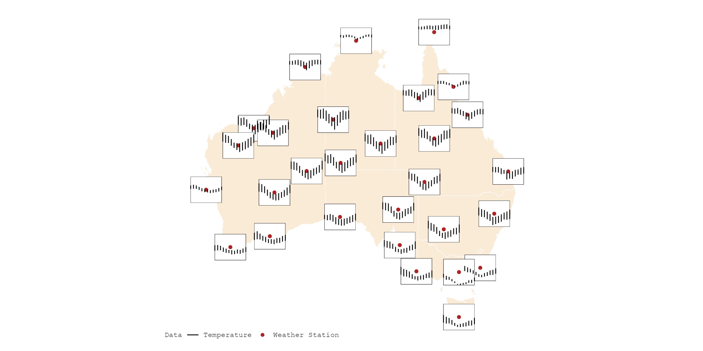
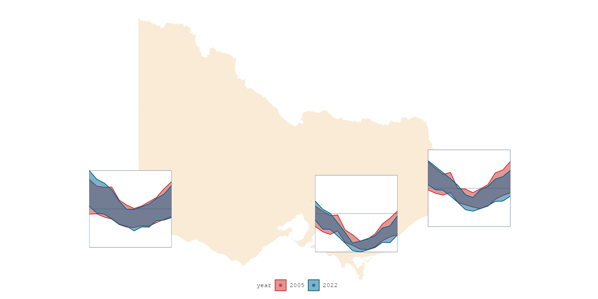
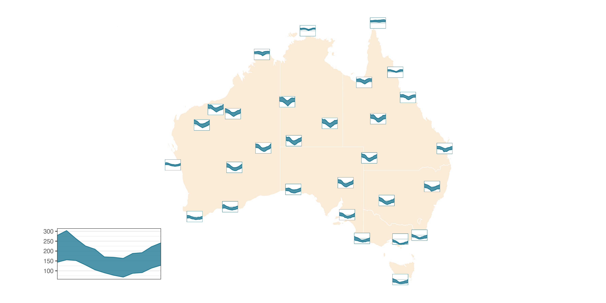

```{r setup, include=FALSE}
knitr::opts_chunk$set(echo = FALSE,
                      warning = FALSE, 
                      message = FALSE,
                      out.width = "100%",
                      fig.align = "center")


library(sugarglider)
library(knitr)
library(ggplot2)
library(sf)
library(tidyverse)
library(grid)
library(viridis)
library(gridExtra)
library(ozmaps)
library(ggthemes)
library(kableExtra)
library(usmap)
library(ggiraph)
library(leaflet)
library(tinytex)
```

# Introduction 

Spatiotemporal data visualization allows users to explore events and interactions across space and time. This approach enables the discovery of temporal patterns, anomalies, and relationships within the data. As  @kim2017data explains, a natural way to analyze spatiotemporal data is by plotting it on a map and incorporating animation controls or small multiple views to visualize each time step. This method helps analysts gain insights into the spatial distribution of the data and the patterns or correlations that emerge over time within these distributions.

One method for visualizing spatiotemporal data is `glyph maps`. Glyph maps are specialized visual tools that condense multivariate data into a single graphical element positioned at a specific location on the map. Each glyph comprises of two main structural components: spatial coordinates and data values. This visualization allows for the simultaneous viewing of local patterns (specific to individual locations) and global patterns (across all locations). A variation of the glyph map is the Line Glyph. However, one limitation of this type of plot is that it can only display changes over time and does not effectively capture different data components.

To address this limitation, the `sugarglider` package was developed, enhancing glyph maps with the addition of ribbon and segment glyphs specifically designed for exploring variations and seasonal components in spatiotemporal data. This package includes two core functions: `geom_glyph_ribbon()` and `geom_glyph_segment()`, which enable the creation of ribbon and segment glyph maps, respectively. The `geom_glyph_ribbon()` function visualizes intervals between two values, making it perfect for depicting ranges or uncertainties. Meanwhile, the `geom_glyph_segment()` function connects data points to showcase trends and transitions.

`sugarglider` offers extensive customization features such as adjustable glyph aspect ratios, global or individual scaling, and custom rescaling, allowing users to tailor their visualizations to specific analytical needs. This versatility makes `sugarglider` a valuable tool for researchers and analysts working with spatiotemporal datasets across various fields, including transportation and climate, as discussed in the application section of this paper.

The following sections will explore how `sugarglider` enables users to visualize spatiotemporal data effectively, providing practical examples and highlighting the package’s flexibility in creating insightful and customizable glyph maps.

# Literature Review 

## Spatiotemporal visualization 

Data visualization is often seen as converting unstructured raw data into structured representations that enhance interpretation. @spence2001information, visualization involves creating a mental model or image, a concept that aligns with definitions found in the Oxford Dictionary, where a model is described as either an exemplar or a simplified mathematical representation that aids in calculations and predictions. The general workflow for data visualization consists of four fundamental stages: collecting and storing data, preprocessing to convert data into desirable format, rendering displays through hardware and algorithms, and  interpreting these visualizations through the human perceptual system (@waddell2004introduction). 

Spatiotemporal visualizations offer a particular advantage by providing a global view of activities, enabling the detection of trends and evolution, making them indispensable tools for spatial and temporal analysis and decision-making (@zhong2012spatiotemporal). Various techniques are used in spatiotemporal data visualization, such as multiple maps representing different time moments, dynamic maps with user control, change maps highlighting differences between two-time points, and the space-time cube, a 3D visualization integrating geographical space and time (@andrienko2003exploratory). 

## Glyph-maps 

Glyph maps are specialized forms of multivariate glyph plots that represent each spatial location with a glyph, summarizing data collected over time at that location. As detailed in the paper by @wickham2012glyph, glyph maps are a refined type of multivariate glyph plots in which each spatial location is depicted by a single glyph that encapsulates data collected over time at that point. These maps are instrumental in uncovering both local and global patterns, particularly emphasizing temporal relationships.

The construction of a glyph map evolves around a transformation technique that utilizes principles of linear algebra to convert temporal coordinates (minor coordinates) into spatial coordinates (major coordinates). This transformation is implemented in packages such as `GGally` by @GGally and `cubble` by @JSSv110i07, facilitating a more integrated approach to spatiotemporal data visualization.

For a plot to be helpful for a specific data analysis task, it should make primary comparisons easy to see. Mapping values to the position is one of the most straightforward perceived properties (@f076b642-1914-3749-af10-4b3bcbdaef52). Glyph maps display changes in slope, trend, average value, and variance over time. They organize the graphical elements necessary for temporal comparisons. However, glyph maps, primarily when representing linear trends as icons, may be subject to the Zöllner Illusion, which distorts straight lines. Therefore, accurate perception of change requires the implementation of reference frames and scaling (@wickham2012glyph)

## `ggplot2` extensions

The architecture of `ggplot2` is based on the `ggproto` system of object-oriented programming. Initially, `ggplot2` relied on the proto system for object-oriented tasks, an S3 subclass of the R environment class. Proto objects are manipulated using the `proto()` function, which sets the parent environment, evaluates expressions, and manages lazy evaluation of arguments (@proto).

As the demand for an official extension mechanism in `ggplot2` increased, the limitations of the `proto` system became evident, prompting the adoption of `ggproto`. This transition is documented in @Wickham2016ggplot2, which introduces how to utilize `ggproto` objects to extend `ggplot2` functionalities. Creating a new `ggproto` object is facilitated by the `ggproto()` function, which requires the name of the new class and an existing `ggproto` object from which it will inherit. For instance, to introduce a new statistical transformation, one might create a `ggproto` object that inherits from `stats` and `geoms`. However, merely creating a `ggproto` object does not make it accessible or valuable to the end user.

To bridge this gap, a layer function must be defined by invoking `layer()`, which allocates the provided arguments to either geom parameters, stat parameters, or aesthetics. While developing `ggplot2` extensions, it may seem intuitive to encapsulate extensions as new `geom`, as this is commonly used to add layers to a plot. However, the rich diversity of `ggplot2`'s functionality is often attributed to its varied statistical transformations (stats) rather than just geometric objects (geoms). This observation suggests that a more nuanced approach to designing extensions can enhance the capabilities of the plotting system.

# Software

The `sugarglider` package extends the capabilities of `ggplot2` by introducing functions designed explicitly for visualizing seasonal patterns in spatiotemporal data. It includes `geom_glyph_ribbon()` and `geom_glyph_segment()`, which represent measurements recorded over time at specific locations using glyph maps. These functions enable explicit depictions of seasonal trends by leveraging the combination of *x_major* and *y_major* coordinates. 

The structure of glyph maps in `sugarglider` consists of four main layers: the base map, glyph boxes, reference lines, and ribbon or segment glyphs. Additionally, users can create a legend, adding an extra layer to the glyph maps. Apart from the base map, `sugarglider` offers functionalities to generate all the elements of a comprehensive glyph map, as illustrated in the figure below.

```{r, fig.cap="The diagram depicts the structure of a glyph map. The first layer represents the base map. Subsequent layers comprise glyph boxes and reference lines. The fourth layer encompasses the glyph itself, allowing users to depict ribbon glyphs. The legend layer is optional. It enables users to display a legend—a magnified version of one of the glyphs.", out.width="60%"}

```

Each layer can be plotted independently, and the package supports the creation of glyph maps using ribbon and segment geometries. The core functionality includes:

* `geom_glyph_ribbon()`:  Displays an interval on the y-axis for each *x_minor* value, with the bounds defined by *ymin_minor* and *ymax_minor*. This function draws ribbon geometry using `geom_ribbon()` from `ggplot2` to draw ribbon geometry, resulting in ribbon glyphs. Each glyph is plotted by combining *x_major* and *y_major* coordinates. This functionality is handy for visualizing ranges or uncertainties in the data.

* `geom_glyph_segment()`: Connects *y_minor* to *yend_minor* with a straight line using `geom_segment()` from `ggplot2`, resulting in segment glyphs. Each glyph is plotted by combining *x_major* and *y_major* coordinates.

In addition to these two functions, `sugarglider` offers several other features that enhance the aesthetic and interpretability of glyph maps. The `add_ref_box()` function introduces reference boxes that visually frame individual glyphs, helping to define boundaries and distinguish glyphs from each other. The `add_ref_line()` function draws a horizontal midpoint for each glyph, facilitating comparisons across data points. The `add_glyph_legend()` function allows users to display an enlarged version of a randomly chosen glyph in the bottom-left corner of the panel, enabling users to visualize the data range. Lastly, the `theme_glyph()` function provides a customized theme for glyph maps, built on top of `theme_map()` from `ggthemes`. It adjusts the plot's appearance, including the legend position, text styles, and background settings, to create a clean, visually consistent layout for glyph maps.

```{r, eval = FALSE, echo=TRUE}
# Ribbon glyph
vic_temp |>
   ggplot(aes(x_major = long,
              y_major = lat,
              x_minor = month,
              ymin_minor = tmin,
              ymax_minor = tmax)) +
  add_glyph_boxes() +
  add_ref_lines() +
  geom_glyph_ribbon() +
  theme_glyph()


# Segment glyph
vic_temp |>
   ggplot(aes(x_major = long,
              y_major = lat,
              x_minor = month,
              y_minor = tmin,
              yend_minor = tmax)) +
  add_glyph_boxes() +
  add_ref_lines() +
  geom_glyph_segment() +
  theme_glyph()
```
```{r comparisonPlot, fig.cap = "A comparison between ribbon and segment glyph maps. Glyph boxes and reference lines have been added to frame each glyph and introduce a line that divides each glyph midway, helping users make inferences about the plot. Additional coding is necessary to create the base map and adjust the width and height of each glyph."}


```

The `sugarglider` package provides various customization options for more flexible visualization. It includes features such as the `global_rescale` argument, which allows users to choose between global or individual glyph scaling. Users can also adjust the scaling of minor values within grid cells and the overall width and height of glyphs. This ensures that the glyph map can be finely tuned to meet specific data visualization needs. The following section will explore these features in greater detail and provide practical examples illustrating their application within different visualization contexts.

## Aesthetics  

The functions in `sugarglider` expect spatial coordinates as the major axis and temporal data, along with some measurements, as minor axes. For minor axes, `sugarglider` adopts the same aesthetics as `ggplot2::geom_ribbon()` and `ggplot2::geom_segment()`, but appends `_minor` to each aesthetic name for use in `geom_glyph_ribbon()` and `geom_glyph_segment()`. To incorporate a variable into the glyph plot, it needs to be explicitly defined as an aesthetic. To produce glyph maps, the following aesthetics are required:

|Aesthetics          | Description
|--------------- | ------------------------------------------------
|  `x_major`, `y_major`         | Spatial coordinates that define the position of glyphs.
|  `x_minor`         | Represents temporal data associated with each glyph.
|  `ymin_minor`, `ymax_minor`       | Used by `geom_glyph_ribbon()` to establish the lower and upper bounds of the ribbon geometry within each glyph.
|  `y_minor`, `yend_minor`       | Used by `geom_glyph_segment()` to set the start and end points of the segment geometry within each glyph.

The functions `add_ref_box()`, `add_ref_line()`, and `add_geom_legend()` are compatible with either *ymin_minor*, *ymax_minor*, or *y_minor*, *yend_minor*. Additionally, `sugarglider` introduces several customizable options to tailor the visual aspects further:

|Option          | Default      | Description
|--------------- | ------------ | ------------------------------------------------
| `colour`         | `"black"`         | Sets the color for line segments and borders.
|`linewidth`      | `0.5`          | Specifies the width of the line for borders.
|`linetype`         | `1`          |  Defines the style of the line for borders.
|`fill`     | `"black"`     | Determines the color of the interior area of the geometries.
|`alpha`      | `0.8`        | Controls the transparency level of the glyphs.

## Options  

Options within the `sugarglider` package allow you to tailor the behaviour of your visualizations to meet the specific needs of your analysis. The *global_rescale* argument controls whether rescaling should occur globally across all data points or be handled individually for each glyph.

`sugarglider` also offers a variety of customizable features to enhance the flexibility and precision of visualizations. For example, it facilitates the scaling of minor values within the glyph along the x and y axes. Users can specify their rescale function by replacing *"identity"* with a custom function in *x_scale* and *y_scale*. Suppose a user wishes to modify the rescaling function on only one axis. In that case, they can replace the value of the corresponding parameter with their chosen function and retain "identity" for the other. In this package, "identity" rescales the minor axes to an interval of [-1,1]. The impact of rescaling on glyphs and its implications for visual interpretation will be thoroughly discussed in the upcoming section.

Additionally, the width and height of the glyphs are adjustable, allowing users to modify the appearance of each glyph to match the dimensions and scaling of the data being visualized. These customization options ensure that `sugarglider` can adapt to a broad range of data types and requirements, making it a versatile tool for seasonal spatiotemporal data visualization.

|Option          | Default      | Description
|--------------- | ------------ | ------------------------------------------------
| `x_scale`         | `"identity"`         | This function scales each set of minor values within a grid cell along the x-dimension.
|`y_scale`      | `"identity"`          | This function scales each set of minor values within a grid cell along the y-dimension.
|`width`         | `"default"`          |  The width of each glyph. The `default` is set to the smallest distance between two consecutive coordinates, converted from meters to degrees of latitude using the Haversine method.
|`height`     | `"default"`     | The height of each glyph. The `default` is calculated using the ratio (1:1.618) relative to the `width`, to maintain a consistent aspect ratio.
|`global_rescale`      | `TRUE`        | Determines whether rescaling is applied globally across all glyphs or individually for each glyph

## Data structure 

When using the `sugarglider` package to create glyph plots, the first step is to ensure that your data is in the correct format. There are two data structures to consider per @JSSv110i07, and one is compatible with `sugarglider`. The package supports data structured in an extended format with temporal and spatial elements.

The package includes a dataset named `aus_temp`, which is sourced from The National Oceanic and Atmospheric Administration (NOAA). This dataset provides a comprehensive set of climate data from 29 stations across Australia for 2020. It includes crucial climate variables such as precipitation and temperature, key spatial elements (longitude and latitude), temporal elements (month), and temperature ranges. These temperature ranges are crucial for determining the widths of the ribbon and segment plots in glyph maps.

```{r, echo = TRUE}
glimpse(aus_temp)
```

Datasets may not always include both spatial and temporal elements. Analysts often start with station data that provides geographic locations, recorded variables, and their time periods. To extract relevant data, they can query the temporal variables for specific stations of interest. In some cases, analysts may start with purely spatial or purely temporal data, which then requires additional elements to transform it into a spatiotemporal format.

For these situations, the `cubble` package offers functions such as `make_cubble()` to help users structure their data into `cubble` objects, optimised for glyph-maps use. This structuring facilitates the creation of detailed and insightful spatiotemporal visualizations, enabling the data to be seamlessly integrated into the `sugarglider` package.

## Rescale

In `sugarglider`, rescaling is a crucial preprocessing step applied to the minor axes, the data used to plot individual glyphs. This rescaling prepares the data for a linear transformation that maps temporal data onto a spatial representation. This vital process will be explored in greater detail in the subsequent section. The rescaling mechanism is governed by two parameters: *x_scale* and *y_scale*. The *x_scale* parameter adjusts the minor values along the x-dimension within each glyph, while *y_scale* modifies them along the y-dimension.

By default, the rescaling function is set to "identity", which adjusts the minor axes to fit within the interval [-1, 1]. However, users can customize the rescaling function by replacing the default settings for *x_scale* and *y_scale* with their functions. For example, the following code demonstrates a custom rescale function that transforms values to fit within the interval [0, 1]. When this custom rescale is applied, the resulting ribbon in the plot appears significantly thinner compared to the previous example, which used the default rescaling settings.

```{r, eval=FALSE, echo=TRUE}
# Default rescale 
nsw_temp |>
   ggplot(aes(x_major = long,
              y_major = lat,
              x_minor = month,
              ymin_minor = tmin,
              ymax_minor = tmax)) +
  geom_glyph_ribbon() +
  theme_glyph() 

# Custom rescale 
custom_rescale <- function(dx) {
  rng <- range(dx, na.rm = TRUE)
  # Rescale dx to [0,1]
  rescaled <- (dx - rng[1]) / (rng[2] - rng[1])
}

nsw_temp |>
   ggplot(aes(x_major = long,
              y_major = lat,
              x_minor = month,
              ymin_minor = tmin,
              ymax_minor = tmax)) +
  geom_glyph_ribbon(x_scale = custom_rescale,
                    y_scale = custom_rescale) +
  theme_glyph() 
```

```{r defaultRescale, fig.cap="The figure illustrates the effect of rescaling on ribbon glyphs. With the default rescaling, all minor axes are adjusted to fit within the interval [-1, 1], whereas the custom rescale function adjusts the minor axes to the interval [0, 1]. Additional code is required to plot the base map alongside the rescaled glyphs."}


```

To fully grasp the impact of rescaling on mapping temporal data to glyphs, it's important to consider how this process applies to both `geom_glyph_ribbon()` and `geom_glyph_segment()`. The transformation of spatiotemporal data into visual representations will be explored in greater detail in the next section.

Additionally, `sugarglider` allows users to choose whether rescaling is applied globally across all glyphs or individually for each glyph. This behaviour is controlled by the `global_rescale` parameter, which defaults to *TRUE*. When `global_rescale` is set to *FALSE*, users can implement local rescaling, allowing each glyph to be scaled independently. The difference between global and local rescaling is evident in the following example: 

```{r, eval=FALSE, echo=TRUE}
# Global rescale
aus_temp |>
  ggplot(aes(
    x_major = long, 
    y_major = lat, 
    x_minor = month, 
    y_minor = tmin, 
    yend_minor = tmax)) +
  add_glyph_boxes() +
  add_ref_lines() +
  geom_glyph_segment(global_rescale = TRUE) +
  theme_glyph()

# Local Rescale
aus_temp |>
  ggplot(aes(
    x_major = long, 
    y_major = lat, 
    x_minor = month, 
    y_minor = tmin, 
    yend_minor = tmax)) +
  add_glyph_boxes() +
  add_ref_lines() +
  geom_glyph_segment(global_rescale = FALSE) +
  theme_glyph()
```

```{r, fig.cap="The figure highlights the impact of global and local rescaling on segment glyphs. With global rescaling, the temperature range is uniform across all glyphs, allowing users to compare variations in temperature between stations across Australia. In contrast, with local rescaling, the temperature range varies between glyphs, enabling more detailed insights into the temperature distribution at individual stations. Additional code is required to plot the base map and specify the xlim for the sf coordinates."}

include_graphics("figures/global_rescale.png")

```


The rescaling process in `sugarglider` involves several steps. First, the function checks for custom scaling based on the `x_scale` and `y_scale` parameters. It then groups the data based on the designated grouping variable to ensure each glyph is drawn as a distinct path. If `global_rescale` is set to *TRUE*, the data is ungrouped before rescaling the minor axes, ensuring consistent scaling across all glyphs. Conversely, if `global_rescale` is set to *FALSE*, the data remains grouped, resulting in local scaling for each glyph.

For both `geom_glyph_ribbon()` and `geom_glyph_segment()`, rescaling is applied separately to the `ymin_minor` and `ymax_minor` values or the `y_minor` and `yend_minor` values, respectively. This ensures that the lower and upper bounds are adjusted independently to fit within the specified scale, maintaining accuracy in the rescaled value.

## Spatial-temporal transformation

```{r , echo=FALSE, fig.cap="The diagram highlights how spatial data (geographical location) combines temporal data (measurements over time) to create a spatiotemporal visualization. In sugarglider, the transformation maps each station's temporal measurements into a visual glyph, allowing users to see patterns across different spatial locations over time.", out.width="90%"}

```

The construction of a glyph map, as described in @wickham2012glyph, involves a linear combination of two key structural components: spatial location and data values. In this context, the major axes represent the spatial coordinates, latitude ($y_{major}$) and longitude ($x_{major}$). In contrast, the minor axes correspond to time ($x_{minor}$) and a measurement of interest ($ymax_{minor}$ and $ymin_{minor}$). For segment glyphs, the measurement is represented by $y_{minor}$ and $yend_{minor}$.

Once the minor axes are rescaled to the interval [-1, 1], the final coordinates for the ribbon glyph are determined through a linear transformation as follows:

\begin{align}
\text{x} &= \text{x}_{\text{major}} + \frac{\text{width}}{2} \cdot \text{x}_{\text{minor}} \\
\text{ymin} &= \text{y}_{\text{major}} + \frac{\text{height}}{2} \cdot \text{ymin}_{\text{minor}} \\
\text{ymax} &= \text{y}_{\text{major}} + \frac{\text{height}}{2} \cdot \text{ymax}_{\text{minor}}
\end{align}

Similarly, the coordinates for the segment glyph are computed as:

\begin{align}
\text{x} &= \text{x}_{\text{major}} + \frac{\text{width}}{2} \cdot \text{x}_{\text{minor}} \\
\text{y} &= \text{y}_{\text{major}} + \frac{\text{height}}{2} \cdot \text{y}_{\text{minor}} \\
\text{yend} &= \text{y}_{\text{major}} + \frac{\text{height}}{2} \cdot \text{yend}_{\text{minor}}
\end{align}

This linear transformation ensures that the temporal and data components are appropriately aligned with the spatial coordinates, enabling a clear and accurate visualization of spatiotemporal data. 

## Examples

The `aus_temp` dataset is used to demonstrate the functionality of the `sugarglider` package. Using the default rescaling parameters, we can visualize temperature data with `geom_glyph_segment()` alongside `geom_point()` that marks the location of each weather station. Each segment glyph represents local climate data, providing an intuitive way to explore temperature variations across Australia.

The default identity scaling function is applied to each set of minor values within each glyph. This method centres the glyphs vertically and horizontally based on the station's coordinates and adjusts the minor axes to fit within the interval [-1, 1]. This ensures that the glyphs are appropriately scaled and sized to fit within the defined dimensions of the glyph.

```{r, echo=TRUE, eval=FALSE}
aus_temp |>
  ggplot(aes(
    x_major = long, 
    y_major = lat, 
    x_minor = month, 
    y_minor = tmin, 
    yend_minor = tmax)) +
  add_glyph_boxes() +
  geom_point(aes(x = long, y = lat)) +
  geom_glyph_segment() +
  theme_glyph()
```

```{r ,fig.cap="Daily temperature variations across Australian weather stations are visualized using segment glyphs and geom points to mark the locations of the stations on the map. Additional coding is needed to integrate a base map into the visualization. This detailed view reveals that the temperature variation in central Australia is more pronounced than in the coastal regions. Additionally, temperatures in the southeastern areas, such as Victoria and Tasmania, are generally lower than those in the northern regions, highlighting regional climate differences across Australia."}


```

The previous segment glyph map used global rescaling (enabled by default), meaning the glyphs were sized relative to one another based on their data values. By disabling global rescaling, we can observe the effects of local rescaling, where each glyph is resized according to its values.

* Local Rescale (global_rescale = FALSE): Each line segment's length is determined by the local temperature range within a region, highlighting regional differences in temperature patterns.
* Global Rescale (global_rescale = TRUE): The global temperature range dictates the length of each line segment, ensuring consistent data scaling across all regions and facilitating easy comparison.

Building on the analysis, precipitation data across Australia can be visualized using `geom_glyph_ribbon()`. The glyphs are colour-coded to represent different levels of rainfall. In contrast, reference lines and glyph boxes are added to improve clarity and facilitate easy comparisons of precipitation levels across the country.

```{r, echo=TRUE, eval=FALSE}
aus_temp |>
   group_by(id) |>
   mutate(prcp = mean(prcp, na.rm = TRUE)) |>
   ggplot(aes(x_major = long, y_major = lat,
              x_minor = month, ymin_minor = tmin,
              ymax_minor = tmax, 
              fill = prcp, color = prcp)) +
   add_glyph_boxes() +
   add_ref_lines() +
   geom_glyph_ribbon() +
   theme_glyph()
```

```{r, fig.cap="Precipitation and Temperature Ranges Across Australia. This visualization uses color-coded glyphs to depict variations in precipitation levels, with sky blue representing the lowest and navy blue the highest levels. Additional code is required to incorporate a base map and customize the theme further. From the plot, it is evident that coastal areas receive more rainfall than the central regions."}


```

To compare temperature trends across different years for specific regions in Victoria, `geom_glyph_ribbon()` offers an effective way to visualize how temperatures have evolved. Each year is distinguished by a different colour, making the trends clear and easy to interpret.

```{r, echo=TRUE, eval=FALSE}
historical_temp |> 
  filter(id %in% c("ASN00026021", "ASN00085291", "ASN00084143")) |>
   ggplot(aes(color = factor(year), fill = factor(year),
              group = interaction(year,id),
              x_major = long, y_major = lat,
              x_minor = month, ymin_minor = tmin, 
              ymax_minor = tmax)) +
   add_glyph_boxes() +
   add_ref_lines() +
   geom_glyph_ribbon() +
   theme_glyph()
```

```{r, fig.cap="Temperature Trends in Selected Victorian Weather Stations. Additional coding is required for the base map, title, and theme customization. In both years, a noticeable seasonal pattern in temperature is evident, with peaks occurring in the summer months and troughs in the winter."}


```

To further improve map readability, the `add_geom_legend()` function integrates an enlarged version of one of the glyphs in the bottom left corner of the plot. This legend helps users interpret the data scale more effectively.

In the example below, a ribbon glyph map is created using geom_glyph_ribbon() and overlaid on a base map to depict daily temperature variations across Australian weather stations. A legend is added via `add_glyph_legend()`, allowing users to easily interpret the range of daily temperature values based on a randomly selected weather station. Since the legend data is drawn from a single, randomly chosen station, it is essential to set a seed for reproducibility to ensure consistent results.

```{r, echo=TRUE, eval=FALSE}
set.seed(28493)
aus_temp |>
   ggplot(aes(x_major = long, y_major = lat,
              x_minor = month, ymin_minor = tmin,
              ymax_minor = tmax)) +
  add_glyph_boxes() +
  add_ref_lines() +
  add_glyph_legend() +
  geom_glyph_ribbon() +
  theme_glyph() 
```

```{r, fig.cap="Temperature Ranges Across Australia with Glyph Legend. Additional coding is required for the base map and further theme customization. In this example, the glyphs are uniformly scaled, representing a temperature range from approximately 5.0 to 35.0 degrees Celsius."}


```


# Application 

This section presents four examples showcasing the applications of the `sugarglider` package. The first two examples utilize the `Train Service Passenger Counts data` from `DataVic`. The initial example demonstrates the creation of ribbon glyph maps with Leaflet to explore variations in train service passenger counts. The second example uses segment glyphs to analyze daily variations in train passenger count in Melbourne City LGA.
The remaining two examples are based on the `Airline Flight Delay and Cancellation` data from `Kaggle.` The third example features an interactive segment glyphs, developed with `ggiraph`, to analyze flight variations at the top 19 US airports with high cancellation rates. Finally, the fourth example uses ribbon glyphs to compare flight variations between the western and southern regions.

## Train service passenger counts

The `Train Service Passenger Counts` dataset, published by `DataVic`, provides estimated numbers of passengers boarding and alighting from Metro Train and Regional Train services for the 2023-2024 period. These estimates include all individuals aged five and over, excluding train drivers and station staff. For this analysis, the data has been aggregated on an hourly basis and categorized into maximum and minimum passenger counts across weekdays, weekends, and holidays (including public and school holidays).

### Victorian train station patronage

Interactive graphics are particularly useful when working with spatiotemporal data, allowing users to explore the data from multiple perspectives. The `cubble` package exemplifies this by creating linked interactive plots using `crosswalk::bscols()` (@JSSv110i07). This paper will demonstrate how to create interactive glyph maps using leaflet.

Making a glyph map using a leaflet is helpful for high-density data where many observations are clustered together or overlap. With leaflet's ability to pan in and out, we can display all the glyphs regardless of how close they are to each other. Static maps cannot achieve this since we can only plot a certain number of glyphs before it gets overcrowded. 

To create interactive glyph maps with leaflets, we need to save each glyph as an image and add these to the Leaflet base map as icons. The process begins by creating a list of all unique train stations that service metro and vline. We then iterate over each station and generate ribbon glyphs using `geom_glyph_ribbon()`, `add_glyph_boxes()` and `add_ref_lines()`. Each glyph is saved as image, and the file paths for all the images are stored in an object for the next step.

```{r, echo=TRUE, eval=FALSE}

# Generate a list of unique train stations
df_station <- train$station_name |> unique()

# Generate PNG of all the ribbon glyph
purrr::map(1:length(df_station), function(i) {
  dt <- train |> filter(station_name == df_station[i])
  p <- dt |>
  ggplot(aes(x_major = long, y_major = lat,
                   x_minor = month_year, ymin_minor = min_monthly,
                   ymax_minor = max_monthly)) +
    add_glyph_boxes() +
    add_ref_lines() +
    geom_glyph_ribbon() +
    theme_void() 
  
  file_path <- paste0("figures/glyph_", df_station[i], ".png")
  ggsave(file_path)
  return(file_path)
  }) -> train_png 

```

To create the base map for leaflet, we use the `leaflet()` function and `addProviderTiles()` with `CartoDB.Positron` as the provider to achieve a light, grey map aesthetic. A scale bar is also added at the bottom left corner for reference.

```{r, echo=TRUE, eval=FALSE}
# Create a leaflet map 
leaflet_map <- leaflet() |>
  addProviderTiles("CartoDB.Positron") |>
  addScaleBar(position = "bottomleft")
```

Next, we iterate through all the images and convert them into icons using the `makeIcon()` function. Users can control the dimensions of each icon by modifying the `iconWidth` and `iconHeight` arguments. The final step is to add each icon to the Leaflet map using `addMarkers()`. Within the options argument of `addMarkers`, users can fine-tune each glyph's display properties, such as the opacity level. The `label` argument allows users to specify the information they wish to display with the hover-over effect, which is set to display the station ID in this example.

```{r, echo=TRUE,eval=FALSE}
# Loop through the PNG files and add them to the map
for (i in seq_along(train_png)) {
  icon <- makeIcon(iconUrl = train_png[i], iconWidth = 100, iconHeight = 60)

  dt <- train |> filter(station_name == df_station[i])
  leaflet_map <- leaflet_map |>
    addMarkers(lng = dt$long[1], lat = dt$lat[1], icon = icon,
               label = dt$station_name, options = markerOptions(opacity = 0.1))
}

leaflet_map
```

```{r, fig.cap="Screenshot of the hourly train station traffic in Melbourne. Each glyph represents hourly traffic, with peaks occurring during typical commuting hours (morning and evening rush hours)"}

```

The plot visualizes hourly train traffic across various stations in Victoria. Each glyph represents a train station, depicting the fluctuations in train traffic at each location throughout the day.

In the central Melbourne area, especially around major hubs like Melbourne Central Station, there is a significant variation in traffic, with peaks occurring in the middle of the day. This indicates a substantial influx of people, highlighting the central business district (CBD) as the city's primary transit hub.

Some eastern and southeastern train stations exhibit pronounced peaks, marking them as key transit corridors for residents commuting into the city center. These stations are situated along major rail lines, such as the `Cranbourne/Pakenham` and `Lilydale/Belgrave` lines, which cater to large suburban populations.

Moving away from the city center and major rail lines, the glyphs illustrate smaller peaks and greater fluctuations in traffic levels. This suggests that train services are either less frequent or utilized in the outer suburbs compared to the central areas.

### Daily train passenger variations in Melbourne City LGA

```{r, eval=FALSE, echo=TRUE}
weekday <- station |>
  group_by(station_name) |>
  ggplot(aes(x_major = long, y_major = lat,
             x_minor = hour, y_minor = min_weekday,
             yend_minor = max_weekday,
             color = services, fill = services)) +
  add_glyph_boxes() +
  add_ref_lines() +
  geom_glyph_segment(global_rescale = FALSE) +
  theme_glyph() +
  labs(title = "Weekday Patronage") +
  theme_glyph() 


weekend <- station |>
  group_by(station_name) |>
  ggplot(aes(x_major = long, y_major = lat,
             x_minor = hour, y_minor = min_weekend,
             yend_minor = max_weekend,
             fill = services, color = services)) +
  add_glyph_boxes() +
  add_ref_lines() +
  geom_glyph_segment(global_rescale = FALSE) +
  theme_glyph() +
  labs(title = "Weekday Patronage") +
  theme_glyph() 
```

```{r, fig.cap="Patronage at various train stations in Melbourne City LGA on weekdays versus weekends. Each glyph is colour-coded by the number of train services at each station. Additional code is required to construct the base map and customize the plot further. The plot illustrates the behavioral patterns of train patrons, showing high demand during rush hours on weekdays and consistent, elevated demand throughout the weekend."}

```

The plot provides insightful observations into train service traffic within the Melbourne City LGA, emphasizing distinctions between weekday and weekend patronage. A significant volume of train services is apparent in the city loop, where major connecting hubs such as Flinders Street Station are situated. These stations are depicted with darker shades of brown, indicating up to 20 services, starkly contrasting with the lighter color gradients that signify lower train services.

The analysis further reveals a discrepancy in traffic between weekdays and weekends. For the majority of the train stations, there is a larger variation in patronage during the weekend compared to weekdays. This pattern is consistent across all stations, regardless of the number of train lines each station accommodates. Additionally, there are less pronounced peaks during the weekends, as there is high but consistent traffic throughout the day. In contrast, weekdays see significant spikes during rush hours due to large numbers of people boarding trains in the morning and evening for school and work, with fewer patrons in between the peaks. This trend underscores the reliance on public transport during certain time of the day and could be pivotal for future decisions regarding scheduling and resource allocation within the transit system.

## Flight Delay and Cancellation 

The U.S. Department of Transportation (DOT) Bureau of Transportation Statistics monitors the on-time performance of domestic flights operated by major U.S. carriers. The DOT publishes the Air Travel Consumer Report monthly, which summarizes data on on-time, delayed, canceled, and diverted flights.

This dataset, sourced from Kaggle's `Airline Flight Delay and Cancellation` data, has been processed and aggregated to showcase the minimum and maximum number of flights originating from the top 10 U.S. airports with the highest cancellation rates.

### Monthly Flight Variation in US Airport with High Cancellation

This example demonstrates the functionality of `geom_glyph_segment()`, which shows the monthly range of flights for each airport and provides insights into how flight numbers change over time. Additionally, `geom_glyph_ribbon()` visualizes the variation between the minimum and maximum number of flights from each airport, offering a clear depiction of the spread in flight activity.

Users can generate interactive glyphs with `ggiraph::girafe()` using `sugarglider`. First, users need to specify tooltips, which are the details displayed when hovering over the glyphs. In this example, the tooltips consist of station id, month, minimum and maximum temperature across all months. 

Tooltips must be provided in the aesthetic of the `tooltip` argument. The user can then plot their desired glyph map and save it as a ggplot object. This ggplot object is converted into an interactive glyph map using the `girafe()` function. 

```{r, echo=TRUE, eval=FALSE}
# Specify tooltip for ggiraph 
flights <- flights |>
  mutate(tooltip = paste("origin: ",origin,
                         "\nmonth: ", month,
                         "\nmin_flights: ", min_flights,
                         "\nmax_flights: ", max_flights))

fl <- flights |> 
  ggplot(aes(x_major = long, y_major = lat,
             x_minor = month, y_minor = min_flights,
             yend_minor = max_flights,
             tooltip = tooltip)) + 
  add_glyph_boxes() +
  add_ref_lines() +
  geom_glyph_segment() +
  theme_glyph()

# Interactive plot using ggiraph
girafe(ggobj = fl)
```

```{r, fig.cap="Monthly Flight Variability Based on the top 10 US airports with high cancellation rates. Additional codes are needed for the base map and additional theme customization. The graph highlights that airports in certain regions experience more variability than others. Each line segment represent the gap between the minimum and maximum flights. Longer segment indicate more significant month-to-month fluctuations in flight operations."}
include_graphics("figures/monthly-flight-variability.png")
```

This visualization shows the range of departing flights from each airport on a map. Each line represents the flight range for a specific airport, with the length showing the variability in flight numbers across different locations. Notably, airports like ATL and ORD generally handle a higher volume of departing flights than airports such as MCO and PHX. All airports exhibit fluctuations throughout the year, with broader flight intervals in the middle of the year and narrower intervals during the holiday season at year-end.

### Flight Pattern Between Western and Eastern Region

```{r, echo=TRUE, eval=FALSE}
# South Region
flights |> 
  filter(origin %in% c("ATL", "CLT", "MCO", "DFW")) |>
  ggplot(aes(x_major = long, y_major = lat,
             x_minor = month, ymin_minor = min_flights,
             ymax_minor = max_flights)) + 
  add_glyph_boxes() +
  add_ref_lines() +
  geom_glyph_ribbon() +
  theme_glyph()

# West region
flights |> 
  filter(origin %in% c("PHX", "LAS", "LAX", "SEA")) |>
  ggplot(aes(x_major = long, y_major = lat,
             x_minor = month, ymin_minor = min_flights,
             ymax_minor = max_flights)) + 
  add_glyph_boxes() +
  add_ref_lines() +
  geom_glyph_ribbon() +
  theme_glyph()
```

```{r, fig.cap="Comparison of flight patterns between the western and southern regions. Additional codes are needed for the base map and additional theme customization."}


```

`geom_glyph_ribbon()` highlights the disparities in flight volume between regions. The Western region exhibits a more significant variation in the number of flights than the Southern region, as evidenced by the thicker ribbons. Notably, both regions display a significant increase in flight volume discrepancies during the mid-year, reinforcing the findings observed with `geom_glyph_segment()`.

# Conclusion

This paper introduces the R package `sugarglider`, designed to create glyph maps for visualizing spatiotemporal data using customizable ribbon and segment geometries. The package provides two main functions: `geom_glyph_ribbon()` and `geom_glyph_segment()`, which generate ribbon and segment glyphs, respectively. One of the critical features of `sugarglider` is its flexibility in allowing users to customize their visualizations. For example, the `global_rescale` argument enables users to control whether the rescaling of glyphs should be applied globally across all data points or handled individually for each glyph. Additionally, users can adjust the glyphs' width and height, ensuring that each glyph's appearance can be tailored to the specific dimensions and scaling of the data being visualized. The package supports static and interactive graphics, and several examples are included to demonstrate how `sugarglider` can effectively be used for spatiotemporal data visualization.

Two potential directions for future development include handling different data types and improving the handling of glyph overlap. Currently, `sugarglider` expects data in a tidy format, but expanding its functionality to work with lists of vectors or matrices would enhance its usability. Additionally, static maps can become overcrowded when too many glyphs are plotted, making it difficult to interpret the visualizations. A possible solution is to collapse overlapping glyphs into a single glyph, with an accompanying data summary for all the collapsed glyphs. Another approach is to repel glyphs away from each other, to prevent overlap. These improvements would increase the flexibility and scalability of `sugarglider` for a broader range of data visualization tasks.

# Acknowledgements

This work is funded by Google Summer of Code in affiliation with the R Project for Statistical Computing. This article is created using the R packages `knitr` (@knitr) and `rjtools` (@rjtools). The source code for reproducing this paper is available in the supplementary files and also on Github at https://github.com/maliny12/paper-sugarglider. Additionally, the source code for the sugarglider package is available at  https://github.com/maliny12/sugarglider . 


